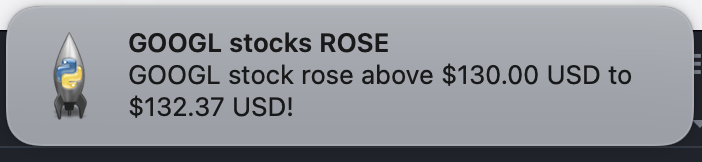

# StockWatch

A program that utilizes webscraping to grab financial data from Yahoo! Finance and sends push notifications to users to help with stock monitoring and day trading.

## Project Description

StockWatch was developed as a tool to enhance investment strategies and optimize day trading activities. By entering just the stock symbol, the program will display the stock’s current price and price difference (from the closing bid) by using real-time data. After which, one is able to set custom price thresholds (price ceilings or price floors) for their selected stock. The program will then monitor the real-time price movements and when it crosses the selected price threshold, it will instantly send a push notification to alert the user about the event.


_Fig 1: This is an example of a notification pushed when the market price crossed a price ceiling threshold_

**Technologies Used:** Python and Python modules including: BeautifulSoup, plyer, requests.

## How to Run

- Clone repo
- Use the package manager [pip](https://pip.pypa.io/en/stable/) to install the python libraries by typing the following into the terminal window one by one:

```
pip install requests
```

```
pip install BeautifulSoup
```

```
pip install plyer
```

```
pip install pyobjus
```

- Now you are set to go!

## Inspiration

As a budding investor, I wanted to develop a tool that would not only assist me but also fellow investors in optimizing their day-to-day investment strategies. Navigating market trends, analyzing stock performances, and making time-crucial decisions can be overwhelming for a beginner. Hence, by combining my technical skills in programming with an interest in the financial stock market and my passion for creative problem-solving, developing this program has been incredibly rewarding.
